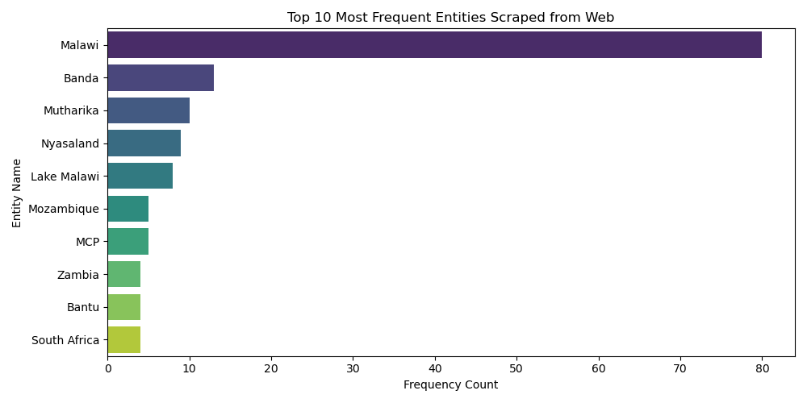

# Carbon & Environmental Policy NLP Tracker`n`nAn automated Python pipeline that scrapes web data, executes Named Entity Recognition (NER) using spaCy, and visualizes entity frequency distributions.`n`n## Pipeline Visual Output`n`n`n`n## How to Run`n`n```cmd`npip install requests beautifulsoup4 spacy pandas seaborn matplotlib`npython -m spacy download en_core_web_sm`npython main.py`n```
